# Base de Datos — MEG

Modelo de datos de **MEG (Mercado de Emprendimiento y Gestión)**, plataforma que conecta a consumidores con emprendedores y MYPES.

> **Fuente de verdad:** `prisma/schema.prisma`. Este documento es una **vista derivada** del esquema; ante cualquier divergencia, prevalece el archivo Prisma y este documento debe actualizarse.

## Tabla de contenidos

1. [Convenciones del modelo](#1-convenciones-del-modelo)
2. [Diagramas por dominio](#2-diagramas-por-dominio)
   - 2.1 [Identidad y roles](#21-identidad-y-roles)
   - 2.2 [Usuarios y cuentas](#22-usuarios-y-cuentas)
   - 2.3 [Negocios y KYC](#23-negocios-y-kyc)
   - 2.4 [Catálogo](#24-catálogo)
   - 2.5 [Pedidos y solicitudes](#25-pedidos-y-solicitudes)
   - 2.6 [Pagos](#26-pagos)
   - 2.7 [Reseñas](#27-reseñas)
   - 2.8 [Mensajería](#28-mensajería)
   - 2.9 [Cupones](#29-cupones)
   - 2.10 [Favoritos](#210-favoritos)
   - 2.11 [Reclamos](#211-reclamos)
3. [Diagrama global](#3-diagrama-global)
4. [Glosario de enums](#4-glosario-de-enums)
5. [Claves compuestas y restricciones de unicidad](#5-claves-compuestas-y-restricciones-de-unicidad)

## 1. Convenciones del modelo

- **Nombres de tabla:** en mayúsculas vía `@@map` (p.ej. `USUARIO`, `SOLICITUD`).
- **Nombres de columna:** en `snake_case`.
- **Clave primaria:** `Int @id @default(autoincrement())` en todas las entidades, salvo las tablas de relación que usan clave primaria **compuesta** (`@@id`).
- **Restricciones de unicidad:** `@unique` en columnas como `correo`, `refresh_token`, `codigo`, `slug`, `sku` y en pares como `[id_usuario, id_item]`.
- **Tipos:** `Int`, `String`, `Boolean`, `DateTime`, `Decimal` (precios/montos) y `Float` (coordenadas y calificaciones).
- **Relaciones:** cada relación de Prisma se refleja en los diagramas con cardinalidad real (1-N, 1-1, N-N vía tabla pivote).
- **Enums:** se documentan en el [glosario de enums](#4-glosario-de-enums); los diagramas los muestran como `String` para legibilidad.

---

## 2. Diagramas por dominio

### 2.1 Identidad y roles

Modelo de control de acceso basado en roles y permisos. `USUARIO_ROL` y `ROL_PERMISO` son tablas de relación con clave primaria compuesta.

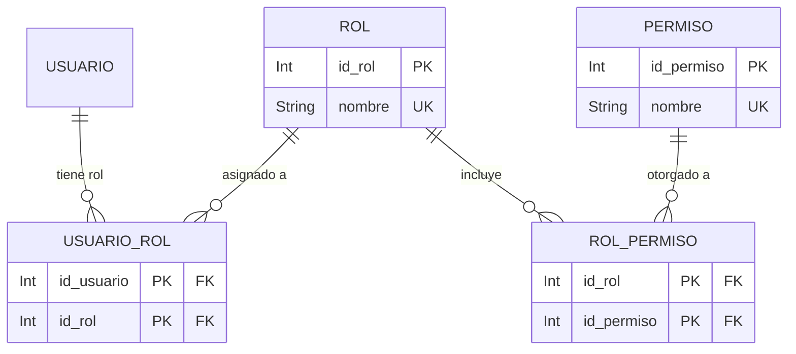

### 2.2 Usuarios y cuentas

Entidad central `USUARIO` y sus datos de cuenta: sesiones, direcciones, notificaciones y logs de auditoría.

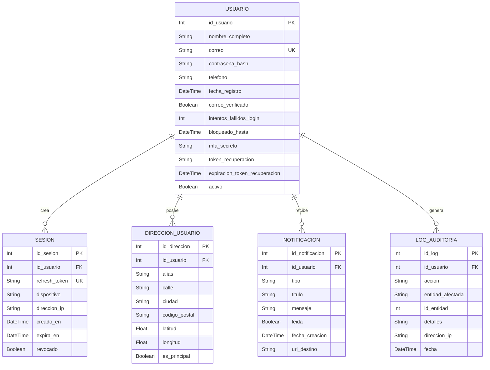

### 2.3 Negocios y KYC

`NEGOCIO` es la entidad del emprendedor/MYPE, con flujo de verificación KYC, horarios, imágenes y asociación a categorías.

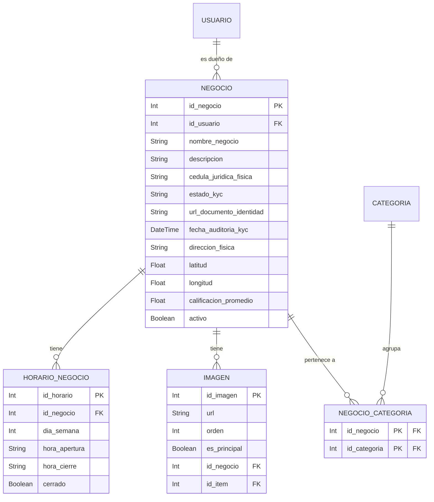

### 2.4 Catálogo

Categorías jerárquicas, productos/servicios (`SERVICIO_PRODUCTO`), variaciones y combinaciones item-variación con stock y SKU.

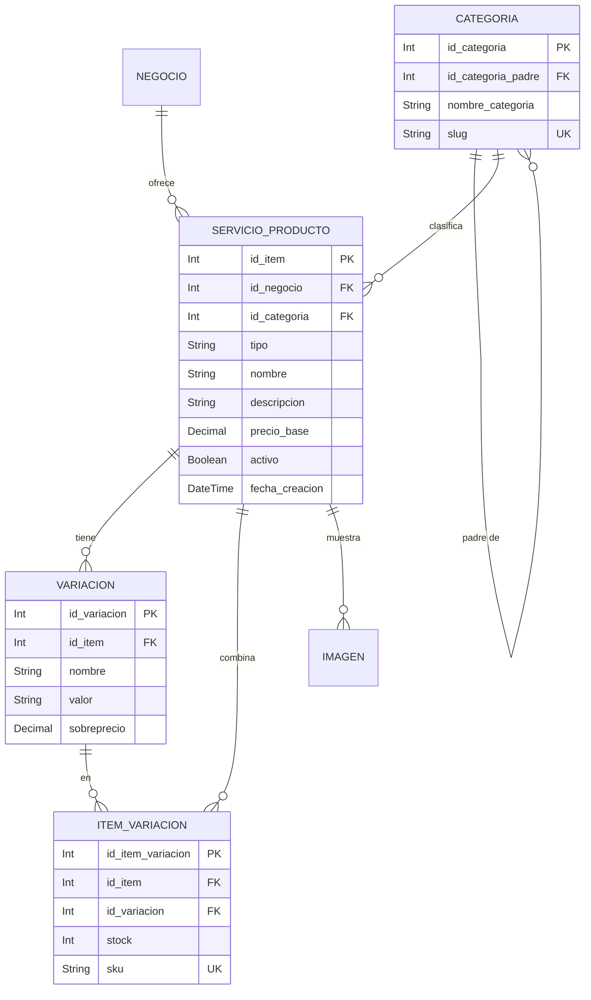

### 2.5 Pedidos y solicitudes

`PEDIDO` (carrito/compra) agrupa varias `SOLICITUD` (por item), cada una con historial de cambios de estado trazable.

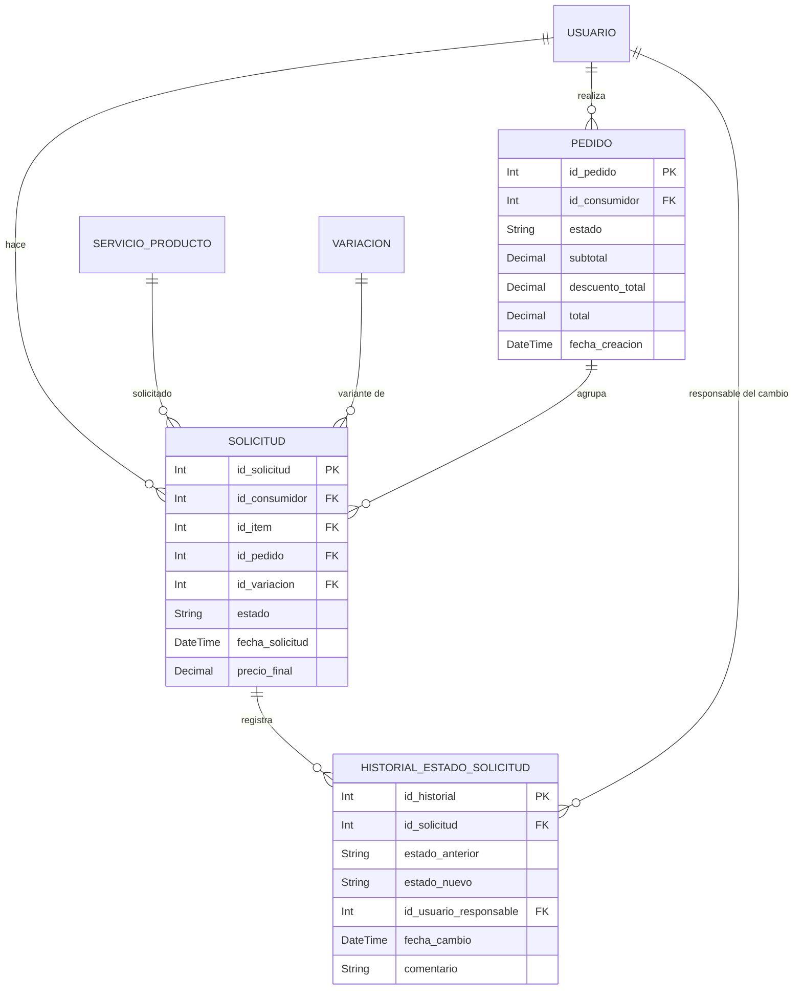

### 2.6 Pagos

`TRANSACCION` puede asociarse a una solicitud individual (1-1) o a un pedido completo (1-N).

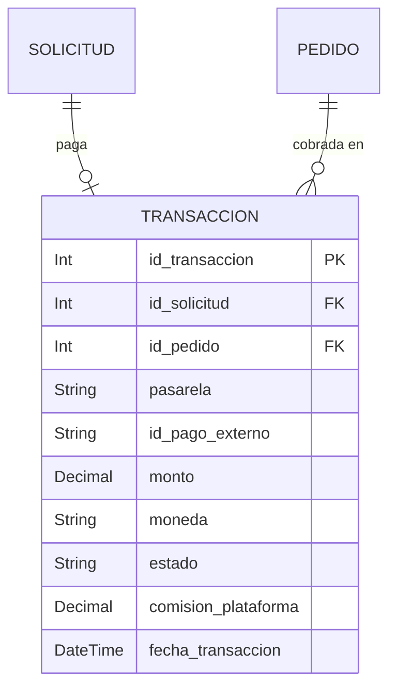

### 2.7 Reseñas

`RESENA` califica a un negocio con 1 reseña por solicitud (relación 1-1), escrita por un usuario (autor).

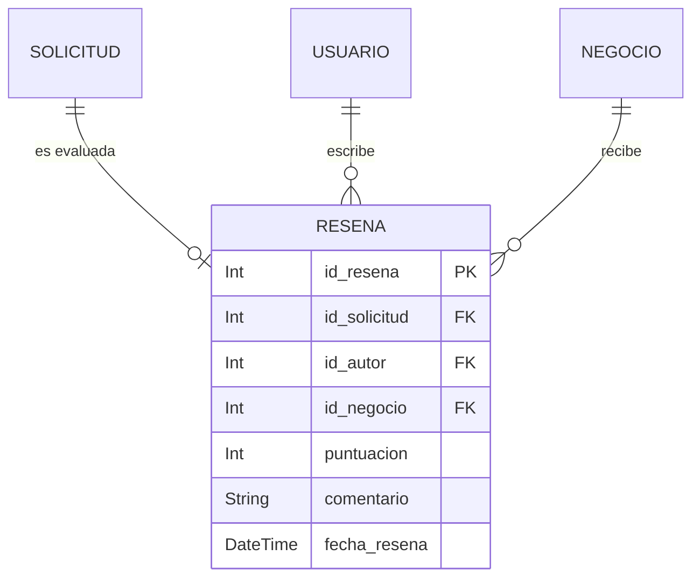

### 2.8 Mensajería

`MENSAJE` es un chat dentro del contexto de una solicitud, entre consumidor y negocio.

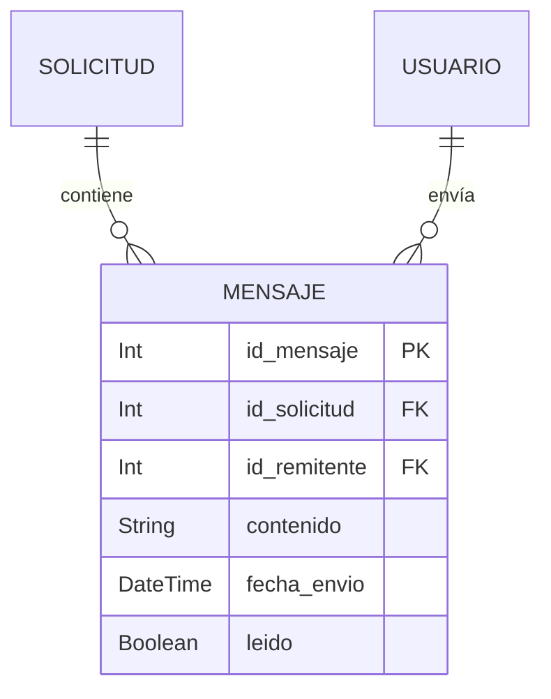

### 2.9 Cupones

`CUPON` define el descuento y su vigencia; `CUPON_APLICADO` registra cada aplicación a un pedido por un usuario.

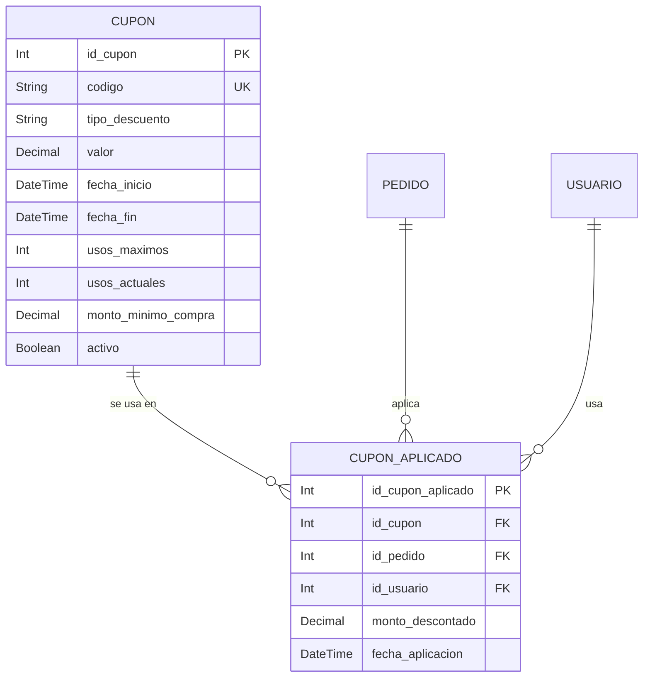

### 2.10 Favoritos

Guardado de items y negocios por usuario, con unicidad por par usuario-item / usuario-negocio.

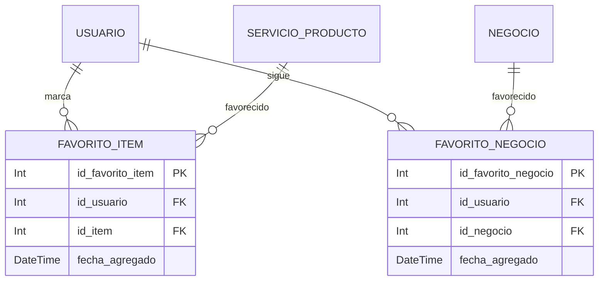

### 2.11 Reclamos

`RECLAMO` se asocia a una solicitud (1-1) e incluye el flujo de resolución gestionado por administradores.

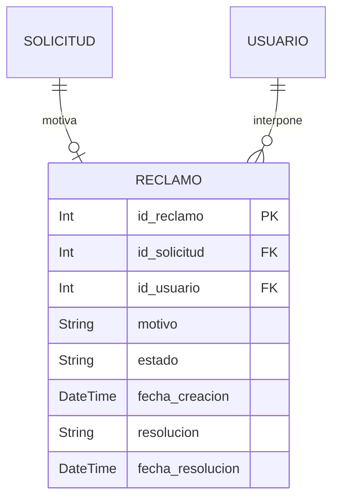

---

## 3. Diagrama global

Vista general de todas las entidades y las relaciones principales entre dominios.

```mermaid
erDiagram
    USUARIO ||--o{ SESION : "crea"
    USUARIO ||--o{ DIRECCION_USUARIO : "posee"
    USUARIO ||--o{ NOTIFICACION : "recibe"
    USUARIO ||--o{ LOG_AUDITORIA : "genera"
    USUARIO ||--o{ USUARIO_ROL : "tiene rol"
    USUARIO ||--o{ NEGOCIO : "es dueño de"
    USUARIO ||--o{ PEDIDO : "realiza"
    USUARIO ||--o{ SOLICITUD : "hace"
    USUARIO ||--o{ RESENA : "escribe"
    USUARIO ||--o{ MENSAJE : "envía"
    USUARIO ||--o{ CUPON_APLICADO : "usa"
    USUARIO ||--o{ FAVORITO_ITEM : "marca"
    USUARIO ||--o{ FAVORITO_NEGOCIO : "sigue"
    USUARIO ||--o{ RECLAMO : "interpone"
    ROL ||--o{ USUARIO_ROL : "asignado a"
    ROL ||--o{ ROL_PERMISO : "incluye"
    PERMISO ||--o{ ROL_PERMISO : "otorgado a"
    NEGOCIO ||--o{ HORARIO_NEGOCIO : "tiene"
    NEGOCIO ||--o{ IMAGEN : "tiene"
    NEGOCIO ||--o{ NEGOCIO_CATEGORIA : "pertenece a"
    NEGOCIO ||--o{ SERVICIO_PRODUCTO : "ofrece"
    NEGOCIO ||--o{ RESENA : "recibe"
    NEGOCIO ||--o{ FAVORITO_NEGOCIO : "favorecido"
    CATEGORIA ||--o{ CATEGORIA : "padre de"
    CATEGORIA ||--o{ NEGOCIO_CATEGORIA : "agrupa"
    CATEGORIA ||--o{ SERVICIO_PRODUCTO : "clasifica"
    SERVICIO_PRODUCTO ||--o{ VARIACION : "tiene"
    SERVICIO_PRODUCTO ||--o{ ITEM_VARIACION : "combina"
    SERVICIO_PRODUCTO ||--o{ SOLICITUD : "solicitado"
    SERVICIO_PRODUCTO ||--o{ FAVORITO_ITEM : "favorecido"
    VARIACION ||--o{ ITEM_VARIACION : "en"
    VARIACION ||--o{ SOLICITUD : "variante de"
    PEDIDO ||--o{ SOLICITUD : "agrupa"
    PEDIDO ||--o{ TRANSACCION : "cobrada en"
    PEDIDO ||--o{ CUPON_APLICADO : "aplica"
    SOLICITUD ||--o{ HISTORIAL_ESTADO_SOLICITUD : "registra"
    SOLICITUD ||--o| RESENA : "es evaluada"
    SOLICITUD ||--o| RECLAMO : "motiva"
    SOLICITUD ||--o| TRANSACCION : "paga"
    SOLICITUD ||--o{ MENSAJE : "contiene"
    USUARIO ||--o{ HISTORIAL_ESTADO_SOLICITUD : "responsable del cambio"

    USUARIO {
        Int id_usuario PK
        String correo UK
    }
    SESION {
        Int id_sesion PK
        Int id_usuario FK
        String refresh_token UK
    }
    DIRECCION_USUARIO {
        Int id_direccion PK
        Int id_usuario FK
    }
    ROL {
        Int id_rol PK
        String nombre UK
    }
    PERMISO {
        Int id_permiso PK
        String nombre UK
    }
    USUARIO_ROL {
        Int id_usuario PK "FK"
        Int id_rol PK "FK"
    }
    ROL_PERMISO {
        Int id_rol PK "FK"
        Int id_permiso PK "FK"
    }
    NEGOCIO {
        Int id_negocio PK
        Int id_usuario FK
        String estado_kyc
    }
    HORARIO_NEGOCIO {
        Int id_horario PK
        Int id_negocio FK
    }
    NEGOCIO_CATEGORIA {
        Int id_negocio PK "FK"
        Int id_categoria PK "FK"
    }
    IMAGEN {
        Int id_imagen PK
        Int id_negocio FK
        Int id_item FK
    }
    CATEGORIA {
        Int id_categoria PK
        Int id_categoria_padre FK
        String slug UK
    }
    SERVICIO_PRODUCTO {
        Int id_item PK
        Int id_negocio FK
        Int id_categoria FK
        Decimal precio_base
    }
    VARIACION {
        Int id_variacion PK
        Int id_item FK
    }
    ITEM_VARIACION {
        Int id_item_variacion PK
        Int id_item FK
        Int id_variacion FK
        String sku UK
    }
    SOLICITUD {
        Int id_solicitud PK
        Int id_consumidor FK
        Int id_item FK
        Int id_pedido FK
        Int id_variacion FK
    }
    PEDIDO {
        Int id_pedido PK
        Int id_consumidor FK
    }
    HISTORIAL_ESTADO_SOLICITUD {
        Int id_historial PK
        Int id_solicitud FK
        Int id_usuario_responsable FK
    }
    TRANSACCION {
        Int id_transaccion PK
        Int id_solicitud FK
        Int id_pedido FK
    }
    RESENA {
        Int id_resena PK
        Int id_solicitud FK
        Int id_autor FK
        Int id_negocio FK
    }
    MENSAJE {
        Int id_mensaje PK
        Int id_solicitud FK
        Int id_remitente FK
    }
    NOTIFICACION {
        Int id_notificacion PK
        Int id_usuario FK
    }
    CUPON {
        Int id_cupon PK
        String codigo UK
    }
    CUPON_APLICADO {
        Int id_cupon_aplicado PK
        Int id_cupon FK
        Int id_pedido FK
        Int id_usuario FK
    }
    FAVORITO_ITEM {
        Int id_favorito_item PK
        Int id_usuario FK
        Int id_item FK
    }
    FAVORITO_NEGOCIO {
        Int id_favorito_negocio PK
        Int id_usuario FK
        Int id_negocio FK
    }
    RECLAMO {
        Int id_reclamo PK
        Int id_solicitud FK
        Int id_usuario FK
    }
    LOG_AUDITORIA {
        Int id_log PK
        Int id_usuario FK
    }
```

---

## 4. Glosario de enums

| Enum | Valores | Uso |
|---|---|---|
| `EstadoKyc` | `Pendiente`, `Aprobado`, `Rechazado` | `NEGOCIO.estado_kyc` |
| `TipoItem` | `Producto`, `Servicio` | `SERVICIO_PRODUCTO.tipo` |
| `EstadoSolicitud` | `Pendiente`, `Aceptada`, `Completada`, `Cancelada` | `SOLICITUD.estado`, `HISTORIAL_ESTADO_SOLICITUD.estado_anterior/nuevo` |
| `EstadoTransaccion` | `Pendiente`, `Completado`, `Fallido`, `Reembolsado` | `TRANSACCION.estado` |
| `EstadoPedido` | `Carrito`, `Confirmado`, `Pagado`, `Enviado`, `Entregado`, `Cancelado` | `PEDIDO.estado` |
| `TipoNotificacion` | `push`, `email`, `sms` | `NOTIFICACION.tipo` |
| `TipoDescuento` | `porcentaje`, `fijo` | `CUPON.tipo_descuento` |
| `EstadoReclamo` | `Abierto`, `En_revision`, `Resuelto` | `RECLAMO.estado` |

## 5. Claves compuestas y restricciones de unicidad

Restricciones que el diagrama `erDiagram` no expresa directamente:

| Tabla | Tipo de restricción | Columnas |
|---|---|---|
| `USUARIO_ROL` | Clave primaria compuesta | `[id_usuario, id_rol]` |
| `ROL_PERMISO` | Clave primaria compuesta | `[id_rol, id_permiso]` |
| `NEGOCIO_CATEGORIA` | Clave primaria compuesta | `[id_negocio, id_categoria]` |
| `ITEM_VARIACION` | Único compuesto | `[id_item, id_variacion]` |
| `FAVORITO_ITEM` | Único compuesto | `[id_usuario, id_item]` |
| `FAVORITO_NEGOCIO` | Único compuesto | `[id_usuario, id_negocio]` |

Unicidades de columna simple (`@unique`):

| Columna | Tabla |
|---|---|
| `correo` | `USUARIO` |
| `refresh_token` | `SESION` |
| `slug` | `CATEGORIA` |
| `sku` | `ITEM_VARIACION` |
| `codigo` | `CUPON` |
| `nombre` | `ROL` |
| `nombre` | `PERMISO` |
| `id_solicitud` (1-1) | `RESENA` |
| `id_solicitud` (1-1) | `RECLAMO` |
| `id_solicitud` (1-1) | `TRANSACCION` |
