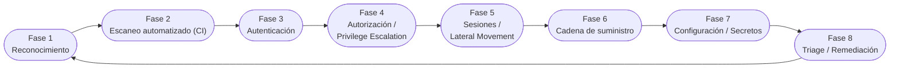
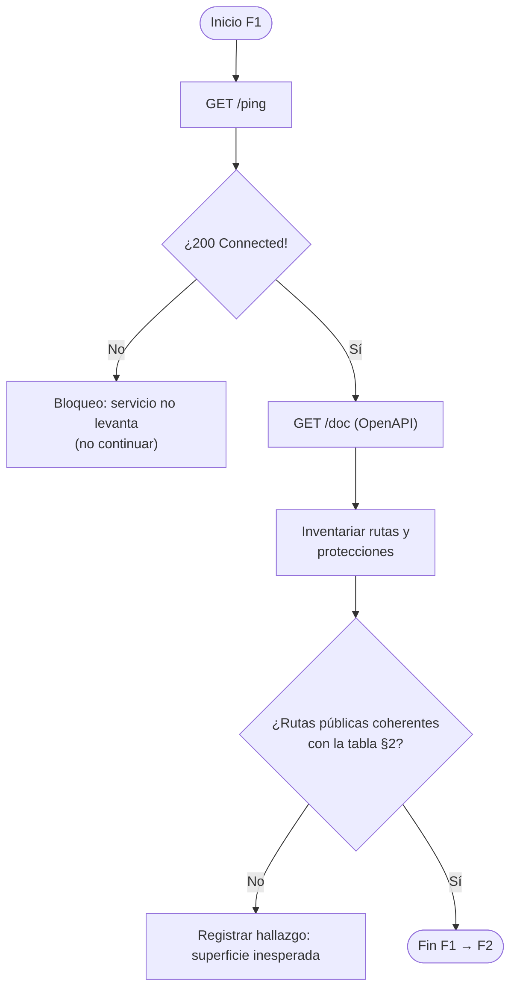
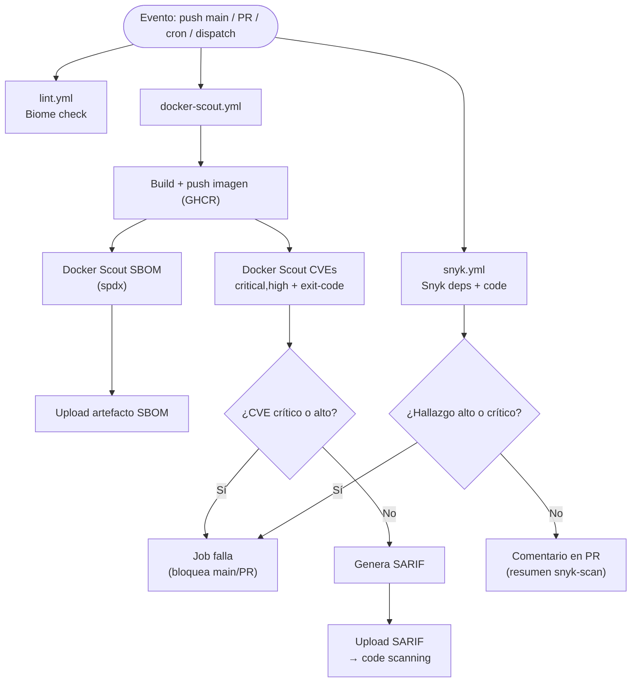
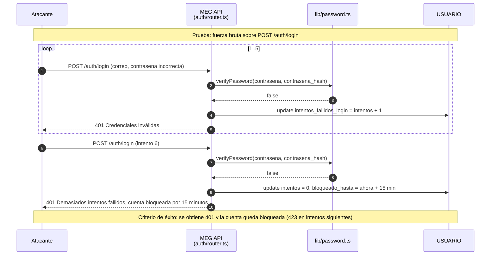
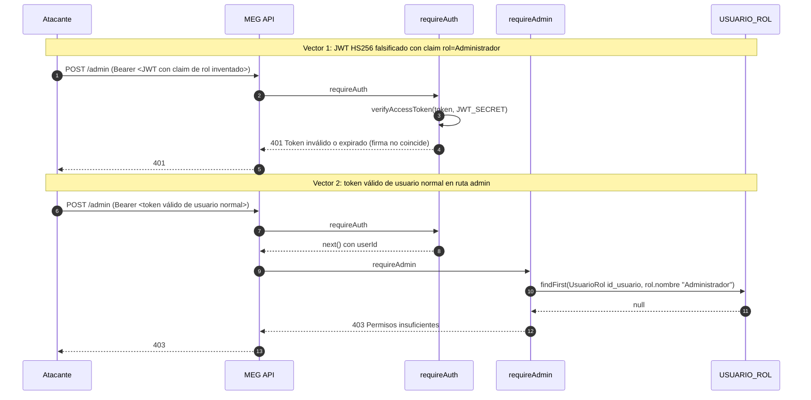
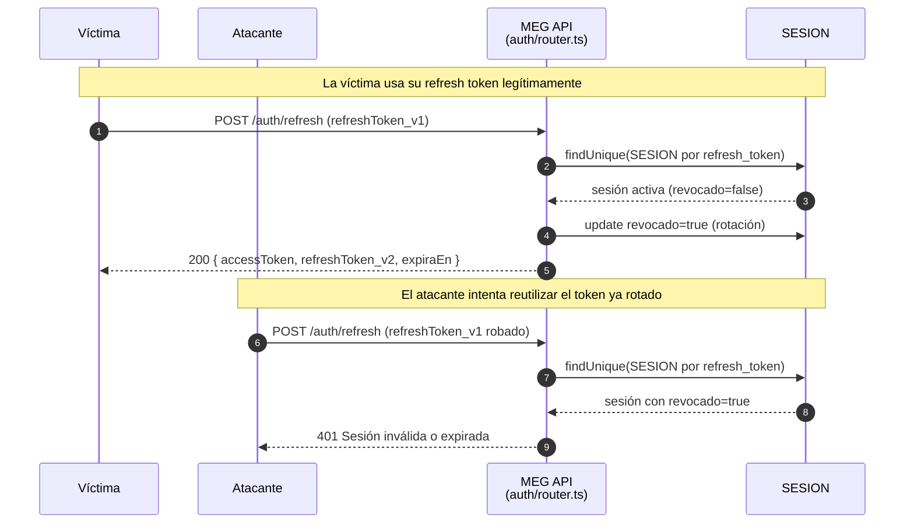
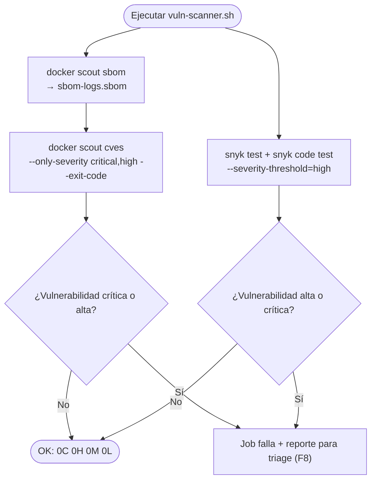
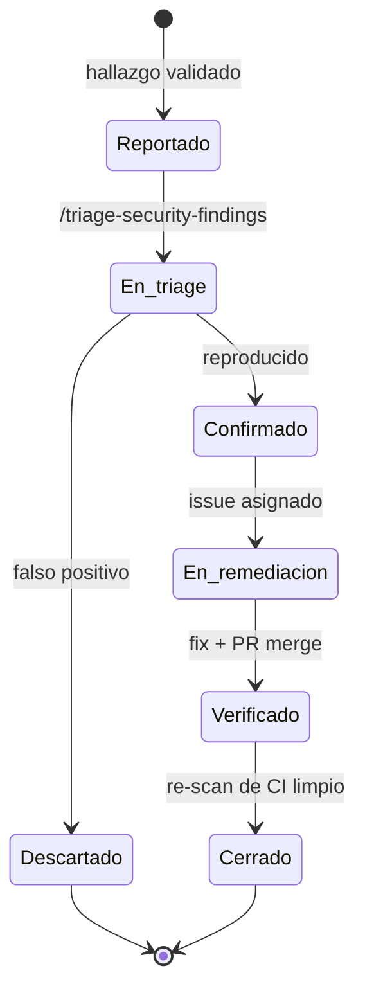

# Pentest Playbook — MEG

Playbook de pruebas de penetración del backend de **MEG (Mercado de Emprendimiento y Gestión)**: qué se prueba, en qué orden, con qué herramientas y con qué criterio de aceptación. Es el documento operativo que conecta las fases de ataque con el CI/CD y con el backlog de remediación.

> **Fuente de verdad:** `.github/workflows/` (CI), `vuln-scanner.sh` (escaneo local) y `src/auth/*`, `src/users/*`, `src/lib/*` (código). Este documento es una **vista derivada**; ante cualquier divergencia, prevalece el código o el CI y este documento debe actualizarse.

## Tabla de contenidos

1. [Convenciones](#1-convenciones)
2. [Superficie de ataque](#2-superficie-de-ataque)
3. [Fases del pentest (visión general)](#3-fases-del-pentest-visión-general)
4. [Fase 1 — Reconocimiento](#4-fase-1--reconocimiento)
5. [Fase 2 — Escaneo automatizado en CI/CD](#5-fase-2--escaneo-automatizado-en-cicd)
6. [Fase 3 — Autenticación](#6-fase-3--autenticación)
7. [Fase 4 — Autorización y escalada de privilegios](#7-fase-4--autorización-y-escalada-de-privilegios)
8. [Fase 5 — Sesiones y movimiento lateral](#8-fase-5--sesiones-y-movimiento-lateral)
9. [Fase 6 — Cadena de suministro](#9-fase-6--cadena-de-suministro)
10. [Fase 7 — Configuración, secretos y despliegue](#10-fase-7--configuración-secretos-y-despliegue)
11. [Fase 8 — Triage, remediación y auditoría de documentación](#11-fase-8--triage-remediación-y-auditoría-de-documentación)
12. [Ciclo de vida de un hallazgo](#12-ciclo-de-vida-de-un-hallazgo)
13. [Inventario de herramientas y mapeo CI](#13-inventario-de-herramientas-y-mapeo-ci)
14. [Reglas de enfrentamiento (ROE)](#14-reglas-de-enfrentamiento-roe)
15. [Referencias](#15-referencias)

## 1. Convenciones

- Las **fases** se numeran de 1 a 8 y se ejecutan en orden; las fases 1 y 2 siempre, las restantes según la superficie afectada por el cambio.
- Se usan los **nombres reales** de rutas, funciones y módulos (`requireAuth`, `requireAdmin`, `verifyAccessToken`, `hashPassword`, `crearSesion`, `auth/router.ts`, `users/router.ts`).
- Los **códigos de respuesta HTTP** (200, 201, 401, 403, 409, 423) y las condiciones de los flujos reflejan el comportamiento real de `src/auth/router.ts`, `src/auth/middleware.ts` y `src/users/router.ts`.
- Cada fase define **criterios de aceptación**: el resultado esperado que confirma que el control funciona (o el hallazgo a reportar si no).
- Los diagramas usan **Mermaid**: `flowchart` para workflows y decisiones, `sequenceDiagram` para ataques/pasos, `stateDiagram-v2` para ciclos de vida.
- Todo hallazgo se registra en el backlog con el flujo de la [§12](#12-ciclo-de-vida-de-un-hallazgo); nada se corrige ad hoc sin pasar por triage.
- **Nada de explotación activa** fuera de entorno autorizado; la [§14](#14-reglas-de-enfrentamiento-roe) define el perímetro.

## 2. Superficie de ataque

Endpoints expuestos por el servicio y fase del playbook que los cubre.

| Endpoint | Protección | Fase |
|---|---|---|
| `GET /ping` | Público | F1 Reconocimiento |
| `GET /doc`, `GET /docs` | Público (OpenAPI + Swagger UI) | F1 Reconocimiento |
| `POST /auth/register` | Público | F3 Autenticación |
| `POST /auth/login` | Público (bloqueo tras 5 intentos fallidos) | F3 Autenticación |
| `POST /auth/refresh` | Requiere `refreshToken` (rotación) | F5 Sesiones |
| `POST /auth/logout` | Requiere `refreshToken` (revocación) | F5 Sesiones |
| `GET /auth/me` | `Bearer` JWT (`requireAuth`) | F4 Autorización |
| `GET /users/{id}` | Público (datos públicos) | F2 Escaneo / F3 |
| `GET /users/me` | `Bearer` JWT (`requireAuth`) | F4 Autorización |
| `PATCH /users/me` | `Bearer` JWT (`requireAuth`) | F4 Autorización |
| `POST /users/me/password` | `Bearer` JWT (`requireAuth`) | F3 / F5 |
| `POST /users/me/deactivate` | `Bearer` JWT (`requireAuth`) | F4 Autorización |

Superficie auxiliar (fuera del tráfico de aplicación, cubierta en F2/F6):

| Elemento | Fuente de verdad | Fase |
|---|---|---|
| Imagen de contenedor `meg-backend` (GHCR) | `Dockerfile` | F2 / F6 |
| Dependencias npm | `package.json`, `package-lock.json` | F6 |
| Esquema de base de datos | `prisma/schema.prisma` | F3 / F4 |
| Workflows GitHub Actions | `.github/workflows/*.yml` | F2 / F7 |
| Variables de entorno | `wrangler.jsonc`, `.env` (local) | F7 |

## 3. Fases del pentest (visión general)

## 4. Fase 1 — Reconocimiento

**Objetivo:** enumerar la superficie expuesta y sus controles antes de ejecutar pruebas.

Actividades:

1. Levantar el servicio en local (`npm run dev`) y confirmar `GET /ping` → `200 "Connected!"`.
2. Enumerar la API desde `GET /doc` (OpenAPI 3.0.3) y revisar los `tags` `Autenticación`, `Usuarios` y `Health`.
3. Identificar qué rutas requieren `Bearer` (security scheme) y cuáles son públicas: `register`, `login`, `refresh`, `logout`, `ping`, `users/{id}`, `doc`, `docs`.
4. Confirmar transporte de tokens solo por header `Authorization: Bearer` (nunca en la URL).

**Criterios de aceptación:** la lista de endpoints coincide con la [§2](#2-superficie-de-ataque); cualquier ruta pública no documentada se reporta como hallazgo (exposición).

## 5. Fase 2 — Escaneo automatizado en CI/CD

**Objetivo:** confirmar que las herramientas de CI cubren la imagen y el código, y que bloquean hallazgos críticos/altos.

Línea base del repositorio:

- `.github/workflows/lint.yml` → `Biome check` en `push` a `main` y `pull_request`.
- `.github/workflows/docker-scout.yml` → Docker Scout SBOM + CVEs en `push` a `main`, `pull_request`, `workflow_dispatch` y `schedule` (lunes 06:00 UTC).
- `.github/workflows/snyk.yml` → Snyk dependencias npm + código (SAST) en `pull_request`, `push` a `main`, `workflow_dispatch` y `schedule` (lunes 06:00 UTC); bloquea severidades altas/críticas y publica el resumen como comentario en el PR.
- `vuln-scanner.sh` → escaneo local: Docker Scout (SBOM + CVEs) + Snyk (deps + código); falla con severidades altas/críticas.

**Criterios de aceptación:**

- El workflow `docker-scout.yml` termina con la imagen limpia (estado esperado: `cves-logs.report` con `0C 0H 0M 0L`).
- Un CVE crítico/alto nuevo debe **fallar** el job (verificar que `exit-code: true` siga presente).
- El SARIF se sube a GitHub code scanning y no se reporta al triage como falso positivo.

## 6. Fase 3 — Autenticación

**Objetivo:** validar registro, login y las protecciones anti fuerza bruta.

Pruebas:

1. **Registro duplicado:** `POST /auth/register` con un correo ya registrado → `409 "El correo ya está registrado"`.
2. **Contraseña débil / datos inválidos:** `400` con mensaje de validación (zod).
3. **Credenciales inválidas:** `POST /auth/login` con contraseña incorrecta → `401 "Credenciales inválidas"`.
4. **Usuario desactivado:** login de un usuario con `activo = false` → `403 "Usuario desactivado"`.
5. **Fuerza bruta:** 5 fallos consecutivos bloquean la cuenta; el intento 6 recibe `401` con mensaje de bloqueo y la cuenta queda con `bloqueado_hasta = ahora + 15 min`.

**Criterios de aceptación:** los códigos `409/400/401/403/423` coinciden con `auth/router.ts`; el bloqueo tras 5 fallos es efectivo y revierte tras 15 minutos o tras un login correcto.

## 7. Fase 4 — Autorización y escalada de privilegios

**Objetivo:** verificar que un usuario no puede obtener permisos que no le corresponden.

El diseño mitiga la escalada con tres capas (documentadas en `docs/security.md` §8.1):

1. **El access token no porta claims de rol:** el JWT solo contiene `sub`/`iat`/`exp`; un claim `rol=Administrador` inventado rompe la firma HS256.
2. **Autorización en BD por request:** `requireAdmin` consulta `USUARIO_ROL` en cada petición.
3. **Ventana corta:** el access token expira en 15 min por defecto.

Pruebas:

- **Vector 1 — JWT falsificado:** enviar un token firmado con un secreto arbitrario o con claims de rol → `401`.
- **Vector 2 — usuario normal en ruta admin:** token válido de un usuario sin rol `Administrador` contra una ruta protegida con `requireAdmin` → `403 "Permisos insuficientes"`.

**Criterios de aceptación:** ambos vectores terminan en `401`/`403`; ningún acceso administrativo se concede con un token de usuario normal.

## 8. Fase 5 — Sesiones y movimiento lateral

**Objetivo:** verificar que un refresh token robado no puede reutilizarse.

El diseño mitiga el movimiento lateral (documentado en `docs/security.md` §8.2):

1. **Rotación de refresh token:** cada uso revoca la sesión anterior (`SESION.revocado = true`).
2. **Revocación por sesión:** `logout` y cambio de contraseña revocan sesiones.
3. **Tokens opacos de alta entropía:** 48 bytes aleatorios (`randomRefreshToken`).
4. **Ventana corta del access token:** 15 min.

Pruebas:

- **Reutilización de un refresh token ya rotado:** usar `refreshToken_v1` después de haber obtenido `refreshToken_v2` → `401 "Sesión inválida o expirada"`.
- **Logout:** usar el refresh token tras `POST /auth/logout` → `401`.
- **Cambio de contraseña:** las sesiones activas anteriores a `POST /users/me/password` quedan revocadas.

**Criterios de aceptación:** ningún refresh token usado, revocado o expirado vuelve a emitir un par de tokens.

## 9. Fase 6 — Cadena de suministro

**Objetivo:** verificar dependencias (npm) e imagen de contenedor contra CVEs conocidos.

Actividades:

1. Ejecutar `./vuln-scanner.sh` (o revisar la última corrida de CI) y confirmar `cves-logs.report` con `0C 0H 0M 0L`.
2. Ejecutar el escaneo Snyk local (deps + SAST): confirmar `snyk-deps-report.txt` y `snyk-code-report.txt` sin vulnerabilidades altas/críticas.
3. Revisar que el SBOM (`sbom-logs.sbom` / `sbom.spdx.json` en CI) se genere y versiona.
4. Validar que el job de CVEs mantenga `exit-code: true` y `only-severities: critical,high` y que el workflow `snyk.yml` mantenga `--severity-threshold=high` (si se relaja, es drift → reportar).
5. Confirmar el `schedule` semanal (lunes 06:00 UTC) para que el escaneo corra aunque no haya `push`.

**Criterios de aceptación:** imagen sin CVEs críticos/altos; el SBOM se publica como artefacto; el job es bloqueante.

## 10. Fase 7 — Configuración, secretos y despliegue

**Objetivo:** verificar que no se exponen secretos ni configuraciones sensibles.

Actividades:

1. **Secretos en el repo:** escanear el historial y los archivos actuales en busca de tokens/claves (manual con `trufflehog`/`gitleaks` o revisión); `.env` debe estar en `.gitignore`.
2. **Workflows:** verificar `permissions` mínimas en los jobs (`contents: read`, `packages: write`, `security-events: write`, `pull-requests: write` en `docker-scout.yml`).
3. **Dependencias de Actions:** revisar que se usen versiones con `@vN` fijas (checkout@v4, setup-node@v4, docker/*-action@vN, github/codeql-action@v3).
4. **Logs:** confirmar que el `onError` de `src/index.ts` no exponga datos sensibles (payload, tokens) en el error `500`.

**Criterios de aceptación:** no hay secretos versionados; los workflows usan permisos mínimos; los errores no filtran información sensible.

## 11. Fase 8 — Triage, remediación y auditoría de documentación

**Objetivo:** convertir hallazgos validados en issues priorizados y auditar que la documentación siga siendo consistente.

Actividades:

1. Clasificar cada hallazgo (falso positivo / confirmado) según la [§12](#12-ciclo-de-vida-de-un-hallazgo).
2. Priorizar por severidad (crítico/alto primero) y por fase de origen.
3. Asignar issue en el backlog (vía `/triage-security-findings` o manual) con evidencia de reproducción.
4. Auditar la documentación: `docs/security.md` y este playbook deben reflejar el estado actual del código; referencias a herramientas ausentes (`EXC-*`) se marcan como `DOC-GAP-*`:

| Gap | Descripción | Estado |
|---|---|---|
| `DOC-GAP-02` | Shannon / Keygraph no está integrado (auditoría de secretos/identidad) | Pendiente — fuera de alcance del repo actual |
| `EXC-*` | Herramientas manuales (Burp, testssl) referenciadas sin how-to dedicado | Pendiente — ver §13 |

**Criterios de aceptación:** todo hallazgo confirmado tiene un issue con owner; los gaps documentales quedan registrados con ID y este playbook se actualiza si cambia la línea base de CI.

## 12. Ciclo de vida de un hallazgo

- **Reportado:** evidencia reproducida (request/response, captura de CI).
- **En triage:** se confirma o descarta.
- **Confirmado:** se asigna severidad, issue y owner.
- **Verificado/Cerrado:** el fix se mergea y el escaneo de CI ya no lo detecta.

## 13. Inventario de herramientas y mapeo CI

Auditoría `playbook ↔ CI ↔ configuración` (modo `audit`). No existe `linear-setup.json`/`securityFindingTriage` en este repo; la columna queda marcada como pendiente hasta correr `sync`.

| Scanner / herramienta | Playbook § | Workflow CI | En `securityFindingTriage` | Estado |
|---|---|---|---|---|
| Docker Scout — SBOM | §5 (F2), §9 (F6) | `docker-scout.yml` (job `scan`, paso `Docker Scout - SBOM`) | — (pendiente) | OK |
| Docker Scout — CVEs (critical/high, bloqueante) | §5 (F2), §9 (F6) | `docker-scout.yml` (paso `Docker Scout - CVEs`, `exit-code: true`) | — (pendiente) | OK |
| Snyk — dependencias npm (high/critical, bloqueante) | §5 (F2), §9 (F6) | `snyk.yml` (paso `Snyk - Dependencias npm`, `--severity-threshold=high`) | — (pendiente) | OK |
| Snyk — código / SAST (high/critical, bloqueante) | §5 (F2), §9 (F6) | `snyk.yml` (paso `Snyk - Codigo (SAST)`, `--severity-threshold=high`) | — (pendiente) | OK |
| Snyk — script local | §9 (F6) | Local (`vuln-scanner.sh`) | — (pendiente) | OK |
| Docker Scout — script local | §9 (F6) | Local (`vuln-scanner.sh`) | — (pendiente) | OK |
| Biome (lint) | §5 (F2, complementario) | `lint.yml` (job `lint`) | — (pendiente) | OK |
| Burp Suite (manual web) | §6–§8 (manual) | — | — (pendiente) | manual-only |
| trufflehog / gitleaks (secretos) | §10 (F7) | — (pendiente) | — (pendiente) | drift |
| shannon / keygraph | §11 (F8) | — | — (pendiente) | `DOC-GAP-02` |
| kube-bench / kube-hunter | N/A (sin Kubernetes) | — | — | N/A |
| testssl | N/A (TLS en el borde de Cloudflare) | — | — | N/A |

**Resumen:** `8 OK, 2 drift (trufflehog, securityFindingTriage), 1 manual-only (Burp), 1 DOC-GAP-02`.

Próximo paso sugerido: `/pentest-playbook-setup sync` para poblar `securityFindingTriage` a partir de los workflows descubiertos y proponer el lane de secretos (`trufflehog`/`gitleaks`) como workflow nuevo.

## 14. Reglas de enfrentamiento (ROE)

- **No hay explotación activa** fuera de entorno autorizado (local `npm run dev` o entorno de staging).
- **No ejecutar** ataques de denegación de servicio, ni fuerza bruta más allá del bloqueo de la cuenta de prueba, ni envíos masivos.
- **Usar siempre cuentas y datos de prueba**; nunca datos reales de clientes ni de producción.
- Los tokens y payloads de hallazgos se **redactan** al reportar (nada de secretos en issues ni en este documento).
- Si una prueba produce un bloqueo de cuenta, esperar la ventana (15 min) o restablecerla por BD antes de continuar.
- Cualquier hallazgo crítico en producción se reporta de inmediato por el canal de incidentes, no solo al backlog.

## 15. Referencias

- `src/auth/router.ts`, `src/auth/middleware.ts`, `src/lib/password.ts`, `src/lib/tokens.ts`, `src/lib/encoding.ts`.
- `src/users/router.ts`, `src/openapi/schemas.ts`, `prisma/schema.prisma`.
- `.github/workflows/docker-scout.yml`, `.github/workflows/lint.yml`, `.github/workflows/snyk.yml`, `vuln-scanner.sh`.
- `docs/security.md` (subsistema de seguridad y mitigación de amenazas), `docs/database.md` (modelo de datos).
- `cves-logs.report` (línea base: `0C 0H 0M 0L`), `sbom-logs.sbom`, `snyk-deps-report.txt`, `snyk-code-report.txt`.
