# Seguridad — MEG

Documentación del subsistema de seguridad del backend de **MEG (Mercado de Emprendimiento y Gestión)**: autenticación, sesiones, control de acceso por roles y decisiones de seguridad.

> **Fuente de verdad:** `src/` (código) y `prisma/schema.prisma` (modelo de datos). Este documento es una **vista derivada**; ante cualquier divergencia, prevalece el código y este documento debe actualizarse.

## Tabla de contenidos

1. [Convenciones](#1-convenciones)
2. [Casos de uso](#2-casos-de-uso)
3. [Diagrama de clases](#3-diagrama-de-clases)
4. [Diagramas de secuencia](#4-diagramas-de-secuencia)
5. [Workflows (diagramas de actividades)](#5-workflows-diagramas-de-actividades)
6. [Diagramas de estados](#6-diagramas-de-estados)
7. [Decisiones de seguridad](#7-decisiones-de-seguridad)
8. [Mitigación de amenazas: Privilege Escalation y Lateral Movement](#8-mitigación-de-amenazas-privilege-escalation-y-lateral-movement)

## 1. Convenciones

- En los diagramas se usan los **nombres reales** de módulos y funciones (`requireAuth`, `requireAdmin`, `verifyAccessToken`, `hashPassword`, `crearSesion`, etc.).
- Las entidades de base de datos se nombran con su `@@map` en **mayúsculas** (`USUARIO`, `SESION`, `ROL`, `PERMISO`, `USUARIO_ROL`, `ROL_PERMISO`).
- **Equivalencias Mermaid–UML:** Mermaid no ofrece un tipo nativo para casos de uso ni diagramas de actividades UML, por lo que:
  - Los **casos de uso** se dibujan con `flowchart` (actores como nodos, casos de uso como elipses dentro del límite del sistema).
  - Los **workflows** (actividades) se dibujan con `flowchart` con nodos de decisión.
  - Los diagramas de **clases**, **secuencia** y **estados** sí usan los tipos nativos `classDiagram`, `sequenceDiagram` y `stateDiagram-v2`.
- Los códigos de respuesta HTTP (401, 403, 423, 200, 201) y las condiciones de los flujos reflejan el comportamiento real de `src/auth/router.ts` y `src/auth/middleware.ts`.

## 2. Casos de uso

Actores y casos de uso del subsistema de seguridad.

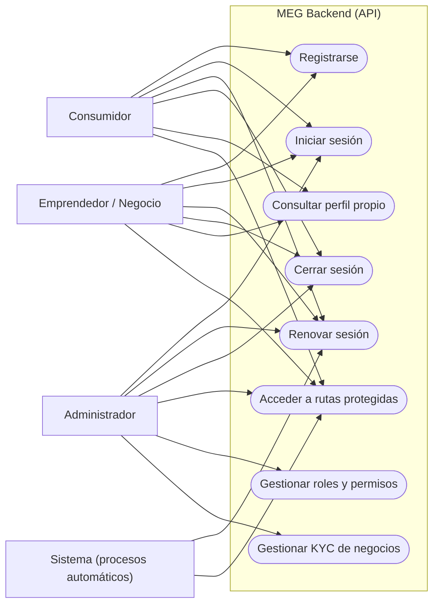

### Mapeo a endpoints reales

| Caso de uso | Endpoint | Protección |
|---|---|---|
| Registrarse | `POST /auth/register` | Público |
| Iniciar sesión | `POST /auth/login` | Público (bloqueo tras 5 intentos fallidos) |
| Renovar sesión | `POST /auth/refresh` | Requiere `refreshToken` (rotación) |
| Cerrar sesión | `POST /auth/logout` | Requiere `refreshToken` |
| Consultar perfil propio | `GET /auth/me` | `Bearer` JWT (`requireAuth`) |
| Acceder a rutas protegidas | Rutas con `requireAuth` | `Bearer` JWT |
| Gestionar roles y permisos | Rutas administrativas con `requireAdmin` (planificado) | `Bearer` JWT + rol `Administrador` |
| Gestionar KYC de negocios | Aprobación KYC con `requireAdmin` (planificado) | `Bearer` JWT + rol `Administrador` |

---

## 3. Diagrama de clases

Entidades de datos del modelo de seguridad y módulos de código que las gestionan.

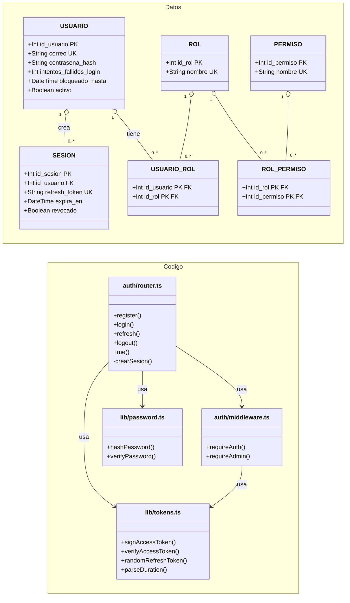

## 4. Diagramas de secuencia

### 4.1 Registro — `POST /auth/register`

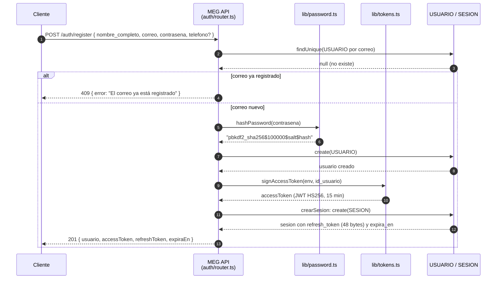

### 4.2 Login — `POST /auth/login`

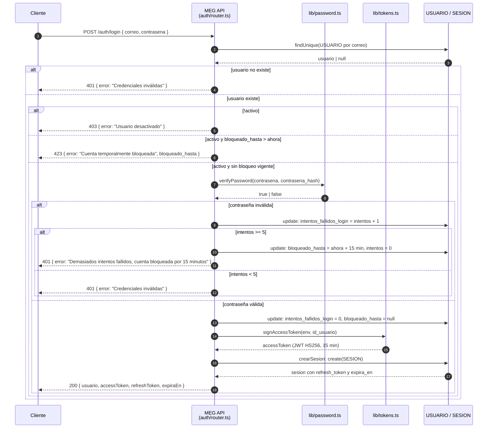

### 4.3 Refresco de sesión — `POST /auth/refresh`

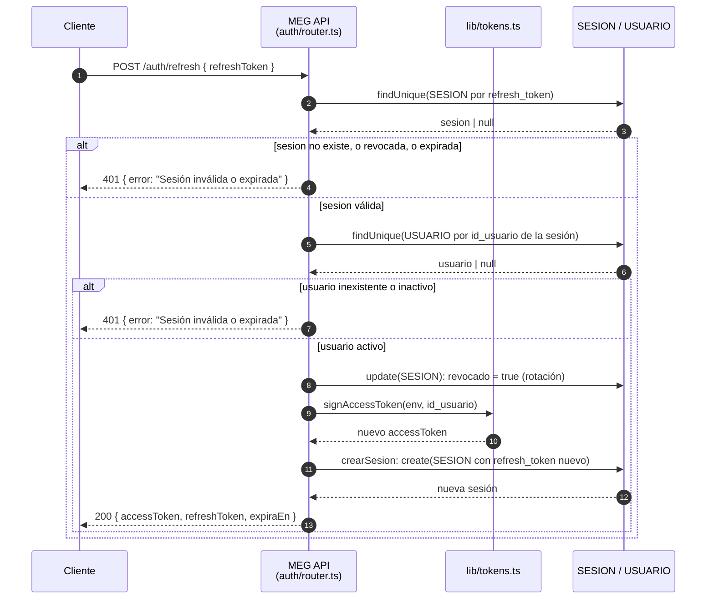

### 4.4 Logout — `POST /auth/logout`

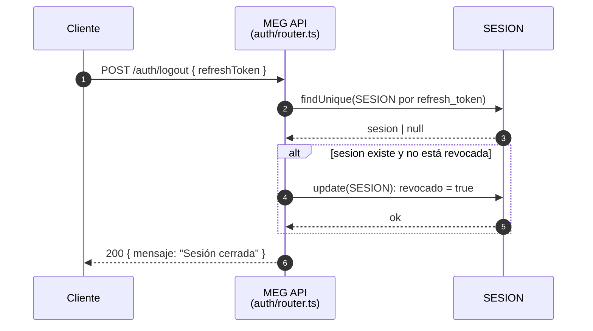

### 4.5 Acceso a endpoint protegido

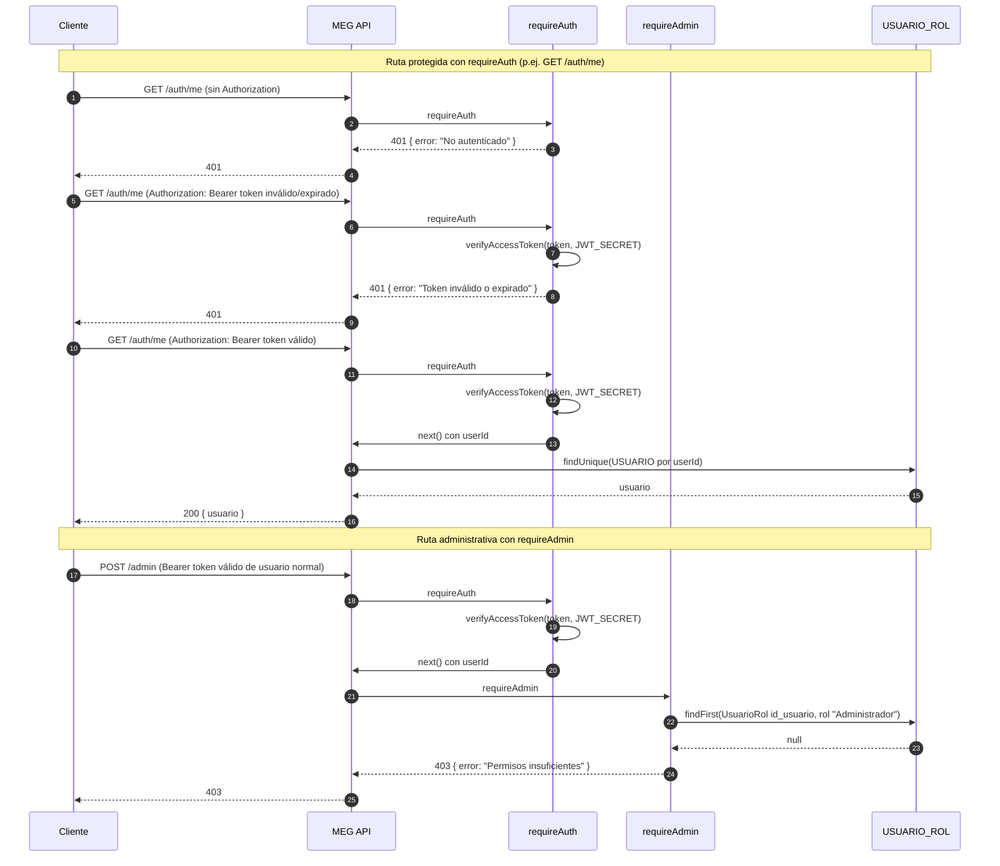

## 5. Workflows (diagramas de actividades)

Flujos de trabajo representados con `flowchart` (equivalentes a diagramas de actividades UML).

### 5.1 Registro

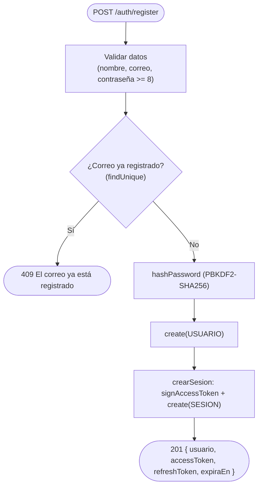

### 5.2 Login

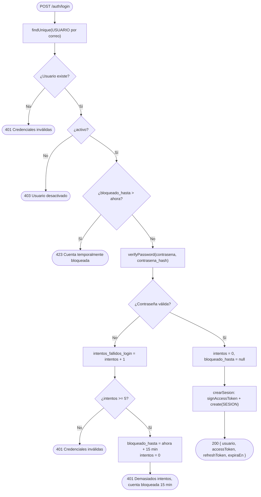

### 5.3 Renovación de sesión

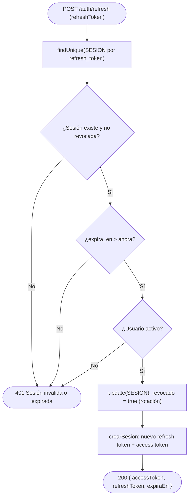

## 6. Diagramas de estados

### 6.1 Ciclo de vida de la sesión

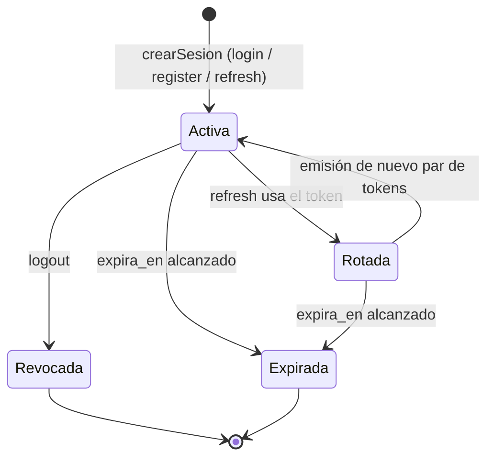

### 6.2 Estados de la cuenta según intentos fallidos

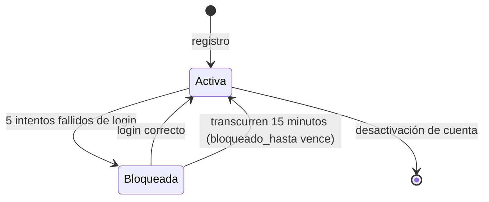

## 7. Decisiones de seguridad

| Decisión | Implementación | Justificación |
|---|---|---|
| Hash de contraseña | PBKDF2-SHA256, 100 000 iteraciones, salt de 16 bytes aleatorios, key de 64 bytes (`hashPassword`/`verifyPassword`) | Derivación lenta y salada que dificulta ataques de fuerza bruta y de tablas precomputadas (rainbow tables). |
| Comparación de hashes | XOR bit a bit en tiempo constante (`verifyPassword`) | Evita ataques de timing que revelen la contraseña. |
| Access token | JWT HS256 (`signAccessToken`/`verifyAccessToken`), payload solo `sub`/`iat`/`exp`, TTL por defecto 15 min | Stateless y verificable sin consultar BD; la ventana corta limita el uso de un token robado. |
| Refresh token | Opaco, 48 bytes aleatorios (`randomRefreshToken`), TTL 30 días por defecto | Alta entropía, no adivinable, no derivable del access token. |
| Rotación de refresh token | Cada uso revoca la sesión anterior (`SESION.revocado = true`) | Un token robado y reutilizado queda inservible (mitiga lateral movement). |
| Revocación por sesión | `logout` y cambio de contraseña revocan sesiones | Permite invalidación individual y control del usuario. |
| Bloqueo por intentos fallidos | Tras 5 fallos, `bloqueado_hasta = ahora + 15 min` | Mitiga fuerza bruta sobre el login. |
| Autorización por rol | `requireAdmin` verifica `USUARIO_ROL` en BD por request | El JWT no porta claims de rol; la escalada de privilegios requiere manipular BD (mitiga privilege escalation). |
| Transporte | Tokens vía header `Authorization: Bearer` (nunca en la URL) | Evita exposición en logs/proxies de URLs. |

**Fuentes de referencia:** `src/auth/router.ts`, `src/auth/middleware.ts`, `src/lib/password.ts`, `src/lib/tokens.ts`, `src/lib/encoding.ts`, `src/types.ts`, `prisma/schema.prisma`.

## 8. Mitigación de amenazas: Privilege Escalation y Lateral Movement

Cómo el diseño del subsistema impide dos ataques clásicos: escalada de privilegios (obtener permisos que no corresponden) y movimiento lateral (reutilizar una sesión robada para desplazarse dentro del sistema).

### 8.1 Privilege Escalation

El backend limita la escalada de privilegios con tres capas:

1. **El access token no porta claims de rol**: el JWT solo contiene `sub` (id de usuario), `iat` y `exp`. Nunca contiene `rol` ni `permiso`. Un atacante que intente inyectar un claim `rol=Administrador` debe re-firmar el token, y como no conoce `JWT_SECRET`, la firma HS256 no valida.
2. **Autorización verificada en BD por request**: `requireAdmin` consulta `USUARIO_ROL` en cada petición y exige una fila con rol `Administrador` vigente. No confía en lo que diga el token.
3. **Ventana corta**: el access token expira en 15 min por defecto, limitando cuánto tiempo sirve un token robado.

#### Vector 1: JWT falsificado con claim de rol

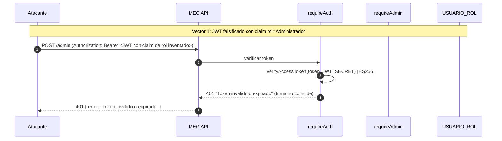

#### Vector 2: Token válido de un usuario normal intentando una ruta admin

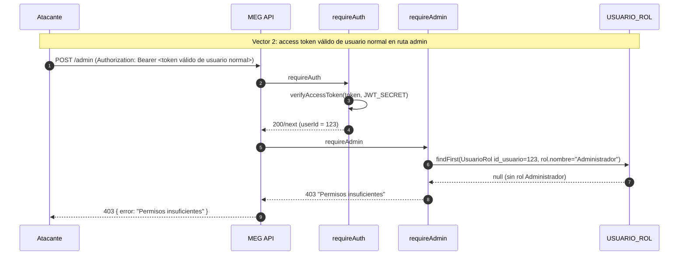

#### Flujo de decisión de `requireAdmin`

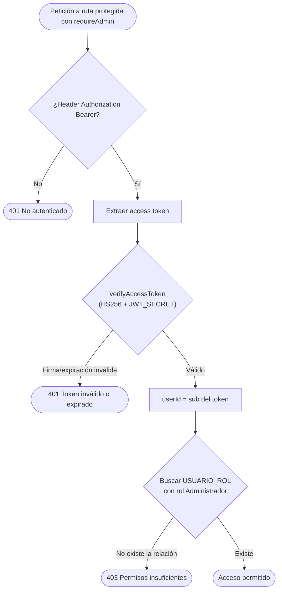

### 8.2 Lateral Movement

El backend impide reutilizar sesiones robadas con:

1. **Rotación de refresh token**: cada uso de un refresh token revoca esa sesión (`SESION.revocado = true`) y emite un par nuevo. Un token ya usado —o robado y usado una vez— queda inservible.
2. **Revocación por sesión**: el logout marca la sesión como revocada; el mismo refresh token no vuelve a servir.
3. **Tokens opacos de alta entropía**: el refresh token son 48 bytes aleatorios (`randomRefreshToken`), imposibles de adivinar o deducir del access token.
4. **Ventana corta del access token**: aunque se robe un access token, expira en 15 min.

#### Reutilización de un refresh token ya rotado

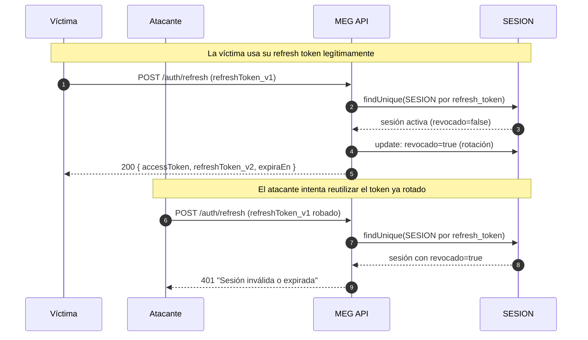

#### Flujo de detección de reutilización en `/auth/refresh`

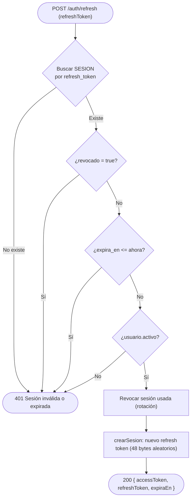
